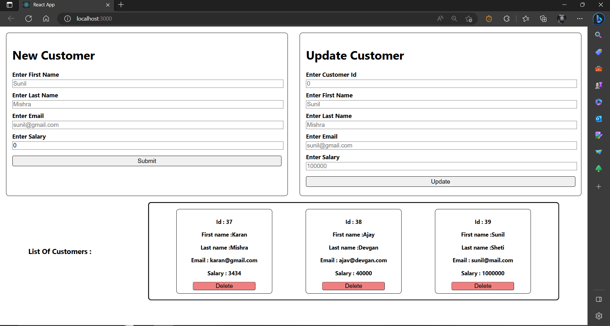

# Customer-Relationship-Manager-Spring-Boot-Hibernate-Maven-Project
### This is a Maven Spring Boot Hibernate project that utilizes JDK 17 and stores data directly into a MySQL database using JPA repository. This project allows you to create and consume RESTful services, which can be used to access and manipulate the data stored in the MySQL database.

#### To run this project, follow the steps below:
1. Clone the repository using the following command:
    ```
    git clone https://github.com/Kartikkumar-Anil-Mahindrakar/CRM-Spring-Boot-Hibernate-Maven-Project.git
    ```
2. Configure the spring and hibernate:
* Create a new database in MySQL using the command line or a MySQL client tool of your choice.
* Update the application.properties file located in the src/main/resources directory with the database connection details such as `spring.datasource.url`, `spring.datasource.username` and `spring.datasource.password`.
3. By finding the class with main method and run the spring boot application.
4. Once the project is running, you can access the RESTful services using a REST client tool such as Postman or by visiting the URLs directly in a web browser.
   #### *POST http request for adding new employee* ```http://localhost:8080/customers```
   #### *GET http request for getting employee with id* ```http://localhost:8080/customers/{id}```
   #### *GET http request for getting list of all employees* ```http://localhost:8080/customers```
   #### *PUT http request for updating employee with id* ```http://localhost:8080/customers/{id}```
   #### *DELETE http request for deleting employee with id* ```http://localhost:8080/customers/{id}```
5. Configure the react js:
   * Open the crm_web_app folder in visual studio code.
   * Now open terminal and type the following command : ```npm install```
6. Now you can run the react application by using the following command : ```npm start```

## Screenshot:

